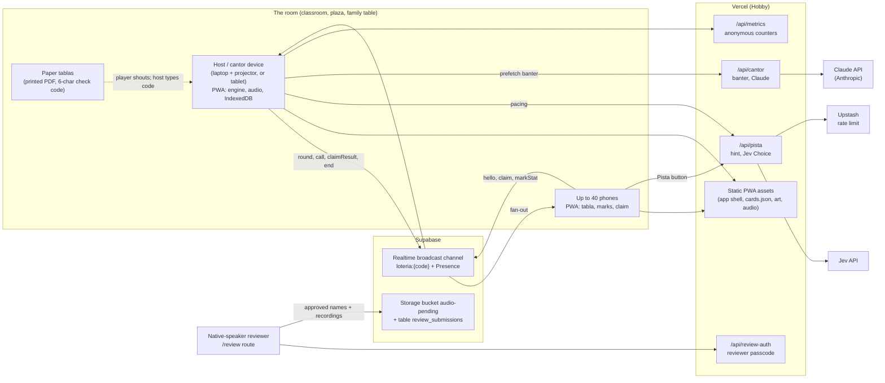

# Lotería de los Pueblos: architecture and dependencies

**Status:** planning. There is no application code yet, so this document describes the system as it is planned. Product scope lives in [README.md](../README.md) and [north-star.md](../north-star.md); build order and task IDs (`LT-xxx`) live in [roadmap.md](../roadmap.md) and [tasks.md](../tasks.md). Where this document and those files disagree, those files win and this one should be fixed.

Every decision below carries one of four labels:

| Label | Meaning |
|---|---|
| **Decided** | Stated in the project brief (north star / README). Change only with a deliberate decision. |
| **Planned** | Named in a task in `tasks.md`. Expected, but can still move while the task is built. |
| **Proposed** | Suggested here to fill a gap. Not agreed; confirm or replace when the relevant task starts. |
| **Open** | A question that needs an answer before or during the named task. |

No version numbers are pinned in this document. Versions are chosen when LT-001 scaffolds the repo and are then recorded in `package.json` and the lockfile, which become the source of truth.

---

## 1. Shape of the system in one paragraph

A single TypeScript codebase builds a static **progressive web app** (Vite + React) and a handful of **Vercel serverless functions** under `api/`. The browser does almost all the work: it shuffles the deck, derives every tabla from a seed, checks claims, plays recorded audio and prints PDFs. A **host device** (the cantor) is the authority for a round. Phones join a **Supabase Realtime broadcast channel** to receive calls and send claims; there is no game server and no game database. The serverless functions exist only for things that need a secret (AI calls, review passcode, metrics ingestion). If the network disappears, the host keeps calling from its precached assets and paper players keep playing.

## 2. Language and tooling

| Area | Choice | Label | Source |
|---|---|---|---|
| Language | **TypeScript** with `strict` on, for both the client and `api/` functions | Decided / Planned | README tech stack, tasks conventions |
| UI framework | **React** | Decided | north star |
| Build tool / dev server | **Vite** (`react-ts` template) | Decided | north star, LT-001 |
| Package manager | **pnpm** | Planned | tasks conventions |
| Lint / format | **ESLint** + **Prettier** | Planned | LT-001 |
| Unit and property tests | **Vitest** | Planned | LT-001, LT-011, LT-012 |
| End-to-end tests | **Playwright** (multi-client rounds, offline test via `context.setOffline`) | Planned | LT-001, LT-032, LT-047 |
| Accessibility checks | axe (in Playwright) | Planned | LT-004, M5 |
| One CI entry point | `pnpm check` (lint, typecheck, unit tests, content validation, i18n check, copy lint) | Planned | LT-001, LT-003, LT-010, LT-053 |
| CI runner | **GitHub Actions** running `pnpm check` + a Playwright smoke test | Planned | LT-001 |
| Path aliases | `@engine`, `@app`, `@net`, `@ai`, `@content`, `@print` | Planned | LT-001 |
| Node.js runtime | Whatever current LTS Vercel supports at scaffold time, pinned via `engines` / `.nvmrc` | Proposed | — |
| Monorepo with Tianguis | Only if both games are built: `packages/ui`, `packages/i18n`, `packages/net` | **Open** | tasks conventions |

## 3. System diagram



**Offline path:** every arrow that crosses into Vercel functions, Supabase, Jev or Claude is optional at play time. With no network the host uses only its own precached `Static` copy, and paper tablas are the players. See section 6.

## 4. Client architecture

### 4.1 Source layout (Planned, README / tasks conventions)

```
src/
  engine/   pure, framework-free game logic: deck, seeded RNG, tablas, codes, claims
  app/      React UI: routes, screens, components, themes
  net/      Supabase Realtime room client and message types
  ai/       HintProvider / pacing providers, online + offline implementations
  content/  cards.json, art/, credits.json, translation catalogs
  print/    pdf-lib tabla generation (runs in a Web Worker)
api/        Vercel functions: pista, cantor, metrics, review-auth
scripts/    draft-versos.ts (Batches API), pull-reviews.ts
public/
  audio/{lang}/{n}.webm   reviewed recordings
docs/       architecture, deck decisions, scale, Jev notes, guides
```

**Rule (Proposed):** `src/engine/` imports nothing from React, the network or the browser beyond standard JS, so it runs identically in the host, in phones, in tests and in a Node script. Everything that must agree across devices (shuffle order, tabla contents, check codes, claim results) lives there.

### 4.2 Screens and routes

| Route | Purpose | Task |
|---|---|---|
| `/` | Home: "Ser cantor", "Imprimir tablas", "Unirme a una sala" | LT-017 |
| cantor screen | Full-screen caller, controls, keyboard shortcuts, Wake Lock | LT-014 |
| print | Choose count, paper size, label language, large print, ink saver | LT-016 |
| `/r/{code}` | Join a room by QR code, get a tabla | LT-031 |
| player tabla | 4×4 grid, beans, "¡Lotería!" button, Pista | LT-032 |
| `/deck` | All 54 cards | LT-010 |
| `/review?lang=…` | Reviewer approval and recording tool | LT-022 |
| `/creditos` | Credits and attributions | LT-026 |
| `/admin` | Passcode-protected north-star dashboard | LT-063 |

### 4.3 Libraries the client needs

| Need | Library | Label |
|---|---|---|
| UI | `react`, `react-dom` | Decided |
| PWA, service worker, precache | `vite-plugin-pwa` (Workbox under the hood) | Planned (LT-002) |
| Translations, ICU plurals | `i18next` + an ICU plugin + React bindings | Planned (LT-003) |
| Realtime rooms | `@supabase/supabase-js` | Decided (Supabase Realtime) |
| Schema validation (content and API payloads) | `zod` | Planned (LT-010, LT-044) |
| PDF tablas | `pdf-lib` (plus `@pdf-lib/fontkit` to embed Noto Sans for Latin-extended glyphs) | Decided / Proposed (fontkit) |
| Font | Noto Sans, self-hosted | Planned (LT-004) |
| Placeholder art | OpenMoji SVGs, CC BY-SA 4.0, attributed in `credits.json` | Planned (LT-010) |
| Routing | `react-router` | **Proposed** |
| App state | React context + `useReducer` for the round; no global store unless it's needed | **Proposed** |
| IndexedDB access | `idb` (small promise wrapper) | **Proposed** |
| QR code rendering (screen and PDF) | a small QR encoder such as `qrcode` | **Proposed** |
| Confetti | a small canvas confetti library, honoring reduced motion | **Proposed** |

Browser APIs used directly: Web Audio and `MediaRecorder` (review recordings), Media Session, Screen Wake Lock, Web Speech (Spanish and English only), Vibration, Web Workers, IndexedDB, sessionStorage.

## 5. Data model

### 5.1 Content (static, versioned in git)

`src/content/cards.json`, validated by a zod schema in CI (LT-010):

```ts
type Lang = 'es' | 'en' | 'nah' | 'yua' | 'quz';
type ReviewStatus = 'draft' | 'reviewed' | 'approved'; // exact set: Open, settle in LT-010/LT-024

interface Card {
  n: number;                 // 1..54
  id: string;                // stable slug, e.g. "ajolote"
  category: 'animals' | 'plants_food' | 'sky_land' | 'handmade' | 'places';
  art: string;               // path under src/content/art/
  tags: string[];            // used by the offline hint matcher
  names: Partial<Record<Lang, {
    text: string;
    ipa?: string;
    status: ReviewStatus;
    source?: string;
    audio?: string;          // public/audio/{lang}/{n}.webm
  }>>;
  verso: { es: string; en: string };
  riddle: { es: string; en: string };
  noteId?: string;
}
```

Also in `content/`: `credits.json` (art, voices, reviewers) and the five translation catalogs.

**Content rules enforced in code:** a call language is offered only if its names are approved, under the `VITE_HIDE_UNREVIEWED` build flag (LT-024); Indigenous-language audio never falls back to synthetic speech (LT-025); the copy lint rejects gendered human roles (LT-053).

### 5.2 Derived game state (never stored on a server)

Everything a claim depends on is **recomputable from small inputs**, which is what makes paper play and offline checking work:

| Value | Derived from | Where |
|---|---|---|
| Call order for a round | `deckOrder(roomSeed, roundNo)`: mulberry32 + Fisher–Yates | `engine/rng.ts` (LT-011) |
| A tabla | `tabla(seed, index) → CardId[16]`, at most 5 per category; `tablaSet` bounds overlap at 8 | `engine` (LT-012) |
| Paper check code | `tablaCode(seed, index)`: 6-char Crockford base32 with checksum; `decodeTablaCode` | `engine` (LT-012) |
| Claim result | `checkClaim(tabla, called, pattern, marks?) → {valid, completedPattern?, missing?}` | `engine` (LT-013) |

**Open:** how `decodeTablaCode` returns a `seedRef` that the host can match to its own room seed (for example, a few seed bits inside the code), and how much of the 6 characters that leaves for the index and checksum. Settle in LT-012.

### 5.3 Room messages (Supabase Realtime broadcast, channel `loteria:{code}`)

The room code is 5 letters from an unambiguous alphabet (LT-030).

| Direction | Message |
|---|---|
| host → all | `round{seed, roundNo, mode, pattern, callLang \| 'rotating', speed}` |
| host → all | `call{i, cardId, lang, at}` |
| host → all | `claimResult{seat, valid, missing?}` |
| host → all | `end{winners}` |
| client → host | `hello{seat, name, glyph, labelLang}` |
| client → host | `claim{seat, tablaIndex, marks[]}` (rate limit 1 per 3 s per seat) |
| client → host | `markStat{seat, ms}` (M4 pacing only) |

Presence tracks seats. **Marks stay on the phone**; only claims travel. The host is the only device that decides a claim. Message types live in `src/net/` and are validated with zod on receipt (Proposed).

**Open:** Realtime broadcast does not authenticate who is "the host". Anyone with the room code could publish a fake `call` or `claimResult`. For classroom use this is probably acceptable, but decide in LT-030 whether to accept it, sign host messages with a per-round key shown only on the host, or use Supabase private channels with a short-lived token from a Vercel function.

### 5.4 Local persistence

| Data | Store | Task |
|---|---|---|
| Host round state (seed, round number, call index, winners, settings) | IndexedDB, so a reload or handover resumes | LT-017, LT-034 |
| Prefetched banter for the next 3 cards | IndexedDB | LT-046 |
| A phone player's marks | sessionStorage | LT-032 |
| Pending telemetry events (queue and flush) | IndexedDB or localStorage | LT-005 |
| Settings (UI, call and label language; theme) | localStorage | Proposed |

### 5.5 Server-side data (the only things stored remotely)

| Data | Where | Label |
|---|---|---|
| Review submissions and pending recordings | Supabase table `review_submissions` + Storage bucket `audio-pending` | Planned (LT-022) |
| Anonymous counters (`round_start`, `card_matched`, `claim`, `round_end`, `print`) | Received by `/api/metrics`; storage backend **Open** (a Supabase table is the obvious choice, since Supabase is already in the stack) | Planned / Open |
| Hint rate-limit counters | Upstash Redis | Planned (LT-044) |

No accounts, no player names, no tabla contents and no marks are stored on any server.

## 6. Offline and paper mode

This is a must-have (100% offline single-device play) and the first thing built (M1).

1. **First online visit** installs the service worker (`vite-plugin-pwa` / Workbox), which precaches the app shell, `src/content/**`, all card art and the audio for every enabled, reviewed language. Budget: about 15 KB per recording × 54 cards × enabled languages, total under 10 MB (LT-002).
2. **`/api/*` is `NetworkOnly`**: never cached, so a stale AI answer can't be served and the client knows immediately that it's offline.
3. **The host alone runs the round**: shuffle, calls, audio, captions, Wake Lock. State is saved to IndexedDB after each call.
4. **Paper tablas** are generated in the browser with `pdf-lib` in a Web Worker (LT-016), from the same seed, so no server is involved in printing either. Each printed board carries its check code and a QR code that lets a phone adopt that board later.
5. **Checking a paper claim**: the host presses `L`, types the 6-character code, and `checkClaim` runs locally against the called set.
6. **AI degrades quietly** (section 9). A Playwright test cuts the network mid-round and asserts no errors (LT-047).

**Open:** iOS Safari's support for Opus audio in a `.webm` container has historically been incomplete. Before committing to `public/audio/{lang}/{n}.webm`, test playback on current iOS Safari and, if needed, also ship an `.m4a` (AAC) or Opus-in-CAF variant chosen at runtime. Decide in LT-022 / LT-025.

## 7. Server functions (Vercel, under `api/`)

All functions are TypeScript, validate input with zod, keep keys server-side, and are optional for play.

| Function | Does | Calls | Fallback if unavailable | Task |
|---|---|---|---|---|
| `/api/pista` | Picks which of a player's 16 cards matches the call (or "none"), with a confidence; also serves the host's pacing `Choice` | Jev `Choice`; Upstash rate limit 60/min per room | Offline tag matcher (hint), threshold rule (pacing). Client timeout 800 ms | LT-044, LT-045 |
| `/api/cantor` | A fresh 2-line verse or one-sentence cultural note, Spanish or English only | Claude via `@anthropic-ai/sdk`, structured output, cached system prompt with the approved-names glossary | The bundled, reviewed verse. Any term outside the glossary is rejected | LT-046 |
| `/api/metrics` | Accepts anonymous counter batches | Metrics store (Open) | Client queue keeps events until next flush; opt-out stops them | LT-005 |
| `/api/review-auth` | Checks the reviewer passcode | — | Review tool unavailable; play unaffected | LT-022 |

Jev never receives audio: in Escucha mode the client sends the card's tags instead (LT-044). Model choice, effort and SDK usage for `/api/cantor` and the content-drafting script are specified in LT-021 and LT-046.

**Open:** the Jev API client. Its package, auth scheme and `Choice` request shape are not documented in the project yet; the "Jev spike" shared with Tianguis (TG-041) should settle them and record them in `docs/jev.md`.

**Proposed:** Edge vs Node runtime. Default to the Node runtime for all four functions (the Anthropic SDK and zod work there with no caveats), and revisit only if cold starts break the 800 ms hint budget.

## 8. Deployment on Vercel Hobby

| Aspect | Plan | Label |
|---|---|---|
| Hosting | One Vercel project on the **Hobby** plan, static build output + `api/` functions | Decided |
| Deploys | Git-connected: every PR gets a preview URL; `main` deploys to production | Planned (LT-001) |
| CI | GitHub Actions runs `pnpm check` and a Playwright smoke test on every PR; preview URL + green CI is the bar | Planned (LT-001) |
| Domain | `loteria.to` (from the repo name) | **Open**: confirm the domain is owned and point it at Vercel |
| Headers | Service worker must be served with no long-lived cache; hashed assets cached immutably | Proposed (`vercel.json`) |

**Things to watch on Hobby (verify against Vercel's current published limits when LT-001 lands; they change):**

- **Non-commercial use.** Hobby is for personal, non-commercial projects. A free community and classroom game fits that; anything sponsored or paid (including a funded pilot) may need a Pro plan. **Open.**
- **Function duration and invocations.** All four functions are short and low volume. `/api/cantor` is the longest; host-side prefetching (next 3 cards) keeps it off the critical path, so a slow response only means the bundled verse is used.
- **Bandwidth.** Card art and audio are fetched once per device and then served from the service worker cache, so a 40-phone room costs roughly 40 × the precache size the first time. Keep the precache budget (< 10 MB) honest.
- **Preview deployments share secrets** with production unless scoped. Scope `ANTHROPIC_API_KEY` and `JEV_API_KEY` deliberately (section 10).

## 9. Supabase

| Aspect | Plan | Label |
|---|---|---|
| Realtime | Broadcast + Presence on `loteria:{code}`; no Postgres changes subscriptions for gameplay | Decided / Planned (LT-030) |
| Why not peer-to-peer | 40 WebRTC peers per room doesn't scale; broadcast does | Decided (north star) |
| Scale target | 40 clients per room, p95 call fan-out < 500 ms, measured in LT-035 and written to `docs/scale.md` | Planned |
| Free-tier budget | 200 concurrent connections and 2M messages a month (per roadmap); one 40-player round ≈ 54 + 40 messages | Planned (roadmap risk table) |
| Storage + table | `audio-pending` bucket and `review_submissions` table for the reviewer tool | Planned (LT-022) |
| Network fallback | Some school networks block WebSockets; the QR screen offers "no network? print tablas" | Planned (roadmap) |

**Open:** free Supabase projects can be paused after a period of inactivity. Confirm the current policy and decide whether a scheduled keep-alive or a paid plan is needed before the classroom pilot (LT-062).

**Open:** whether reviewers upload straight from the browser with the anon key (then Row Level Security and Storage policies must allow insert-only into `audio-pending` and `review_submissions`) or through a Vercel function using the service-role key. The function route keeps the policy surface smaller. Decide in LT-022.

## 10. Environment variables and secrets

Names marked Proposed are placeholders until the task that introduces them.

| Variable | Exposed to browser? | Used by | Label |
|---|---|---|---|
| `VITE_SUPABASE_URL` | yes | Realtime client | Proposed name |
| `VITE_SUPABASE_ANON_KEY` | yes (public by design; safety comes from RLS and channel rules) | Realtime client | Proposed name |
| `VITE_HIDE_UNREVIEWED` | yes (build flag) | Call-language picker | Planned (LT-024) |
| `ANTHROPIC_API_KEY` | **no** | `/api/cantor`, `scripts/draft-versos.ts` | Planned (LT-021, LT-046) |
| `JEV_API_KEY` | **no** | `/api/pista` | Planned (LT-044) |
| `UPSTASH_REDIS_REST_URL`, `UPSTASH_REDIS_REST_TOKEN` | **no** | `/api/pista` rate limit | Read in `api/_lib/redis.ts`; names match Upstash's REST credentials |
| `REVIEW_CODE` | **no** | `/api/review-auth` | Planned (LT-022) |
| `ADMIN_CODE` | **no** | `/admin` dashboard | Proposed name (LT-063) |
| `SUPABASE_SERVICE_ROLE_KEY` | **no** | Review uploads / metrics writes, only if done server-side | Proposed (see Open in section 9) |

Rules (Proposed): anything prefixed `VITE_` is compiled into the public bundle, so no secret ever gets that prefix. Secrets live in Vercel project settings (and GitHub Actions secrets only where a script needs them), never in the repo. Commit a `.env.example` listing names with empty values.

## 11. AI, and what happens without it

The game is fully playable with no AI. Every AI feature sits behind an interface with an offline implementation, chosen at call time.

| Feature | Online | Offline / no-AI fallback | Trigger for fallback |
|---|---|---|---|
| **Pista** hint | `/api/pista` → Jev `Choice` over the 16 cards + "none" | `engine`-side tag/category matcher with a threshold; below it, "Puede que no esté en tu tabla" | No network, non-2xx, or > 800 ms |
| **Pacing** | Host asks Jev `Choice` {slower, same, faster} from the last 3 calls' `markStat` | Rule: slow down 2 s if > 30% missed; speed up 1 s if 90% marked in < 4 s; clamp 6–20 s | Same as above; host can also turn pacing off |
| **Cantor banter** | `/api/cantor` → Claude, Spanish/English, glossary-checked, prefetched 3 ahead into IndexedDB | The bundled, reviewed verse | No network, any error, `stop_reason` not normal, or any non-glossary term. **Off by default in classrooms** |
| **Deck content drafting** | `scripts/draft-versos.ts` → Claude Message Batches, output marked `draft` for human review | n/a (offline authoring) | Build-time only, never at play time |

Hard rules (Decided): no live machine-generated Indigenous-language text; no synthetic speech for Indigenous languages; Claude only quotes reviewed card names; Jev never receives audio. Each hint is labeled with the engine that produced it (roadmap M4 exit criteria).

Proposed interface shape, from LT-043:

```ts
interface HintProvider {
  name: 'jev' | 'matcher';
  pick(call: { cardId?: string; riddleId?: string; audioOnly: boolean },
       myCards: string[]): Promise<{ cardId: string | null; confidence: number }>;
}
```

## 12. Dependency summary

### Runtime (shipped to browsers or functions)

| Package | Where | Label |
|---|---|---|
| `react`, `react-dom` | client | Decided |
| `@supabase/supabase-js` | client (and functions if server-side writes are chosen) | Decided |
| `pdf-lib` | client (Web Worker) | Decided |
| `i18next` + ICU plugin + React bindings | client | Planned |
| `zod` | client + functions | Planned |
| `@anthropic-ai/sdk` | `/api/cantor`, `scripts/` | Planned |
| Upstash rate-limit client | `/api/pista` | Planned |
| Jev client | `/api/pista` | **Open** |
| `@pdf-lib/fontkit` | client | Proposed |
| `react-router` | client | Proposed |
| `idb` | client | Proposed |
| QR encoder (e.g. `qrcode`) | client | Proposed |
| Confetti library | client | Proposed |

### Development and build

| Package / tool | Purpose | Label |
|---|---|---|
| `typescript` | strict typecheck | Decided |
| `vite`, `@vitejs/plugin-react` | build, dev server | Decided |
| `vite-plugin-pwa` (Workbox) | service worker, precache | Planned |
| `eslint`, `prettier` | lint, format | Planned |
| `vitest` | unit + property tests | Planned |
| `@playwright/test` | e2e, multi-client, offline, axe | Planned |
| axe for Playwright | accessibility assertions | Planned |
| `svgo` | optimize card art | Planned (LT-023) |
| Property-testing helper (e.g. `fast-check`) | tabla determinism, overlap and code-typo properties | Proposed |
| `tsx` or similar | run `scripts/*.ts` | Proposed |

### Content and assets

| Asset | License / note | Label |
|---|---|---|
| OpenMoji placeholder art | CC BY-SA 4.0, attributed | Planned |
| Noto Sans | SIL Open Font License, self-hosted | Planned |
| Native-speaker recordings | License chosen by each speaker, consent on file | Planned (LT-064) |
| Commissioned card art | Credit and payment agreed in writing | Planned (LT-023) |

### External services

| Service | Used for | Required to play? |
|---|---|---|
| Vercel (Hobby) | Hosting, preview deploys, functions | Only for the first visit (install) |
| Supabase | Realtime rooms; review uploads | Only for phone players |
| Jev | Hint and pacing | No |
| Anthropic (Claude) | Banter, content drafting | No |
| Upstash | Rate limiting `/api/pista` | No |
| GitHub Actions | CI | No |

## 13. Open questions, collected

| # | Question | Settle in |
|---|---|---|
| 1 | Monorepo shared with Tianguis, or a standalone repo? | Before LT-001 |
| 2 | Is `loteria.to` owned, and is Hobby's non-commercial term fine for the pilot? | LT-001 / before LT-062 |
| 3 | How does a 6-char tabla code carry a seed reference, index and checksum? | LT-012 |
| 4 | Do host messages need authenticity (signed messages or private channels)? | LT-030 |
| 5 | Does iOS Safari play the planned `.webm` Opus audio, or is a second format needed? | LT-022 / LT-025 |
| 6 | Reviewer uploads: browser + RLS, or through a Vercel function? | LT-022 |
| 7 | Where `/api/metrics` stores counters | LT-005 |
| 8 | Jev client package, auth and `Choice` request shape | Jev spike (TG-041) / LT-044 |
| 9 | Supabase free-tier inactivity pausing before the pilot | Before LT-062 |
| 10 | Exact review status values (`draft` / `reviewed` / `approved`) | LT-010 / LT-024 |
| 11 | Code license (tasks propose MIT; README says none chosen yet) | LT-064 |
